# Different Faces Pipeline

The goal is to create faces that are superficially alike (Spanish men in their early 30s with medium-brown hair, for example) but, on closer inspection, are clearly different people. For any given person, it should also be possible to generate more than one picture in which they remain easily recognizable. I choose Demographics (Spanish, Irish,..) because they tend to give very consistent  and particular looks in image generators.

By default, image generators often have the opposite behavior: images can look different at first glance because the setting, clothes, or lighting changed, yet reveal essentially the same face when examined closely.

The pipeline uses text only to define the shared high-level traits, then combines machine search with two human decisions. RealVisXL and Z-Image (the two models I found to have the highest quality) each generate about 500 faces. ArcFace and farthest-point selection reduce each pool to 80 candidates; a person chooses roughly 40 from each model as the seed bank. A fitted identity cloud proposes additional identities, InstantID renders both seeds and samples, and automatic checks plus a final human review retain the people who are most clearly different by eye.

> **Image note:** the figures below were assembled from successive iterations of the experiments. They illustrate the reported behavior, but an individual sheet may have been generated by a slightly different prompt mix, model setting, or pipeline revision than the final pipeline described in Section 3.

## 1. What the pipeline produces

Some examples of results from the pipeline, superficially very similar, but with facial features that distinguish them as different people.

### 1a. Spanish men

Ten different Spanish men with the same broad age, hair, skin, and portrait constraints.

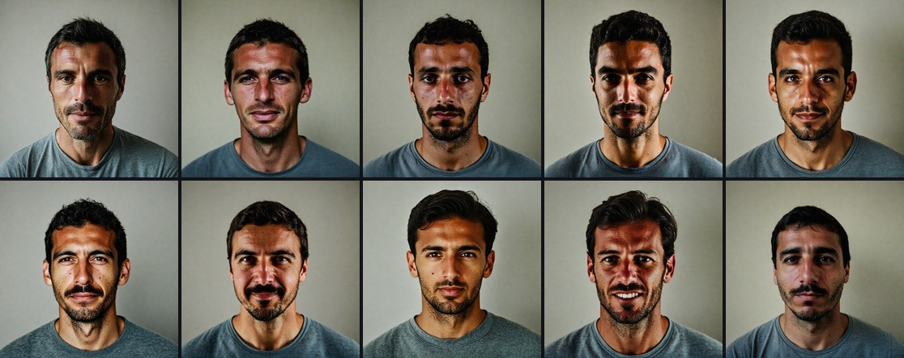

### 1b. Scandinavian women

Ten different Scandinavian women under one shared high-level prompt (Blue eyes, blonde hair).

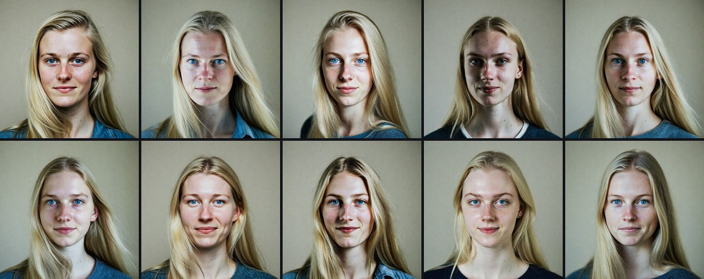

### 1c. Irish women

Ten different Irish women under one shared high-level prompt (Red hair).

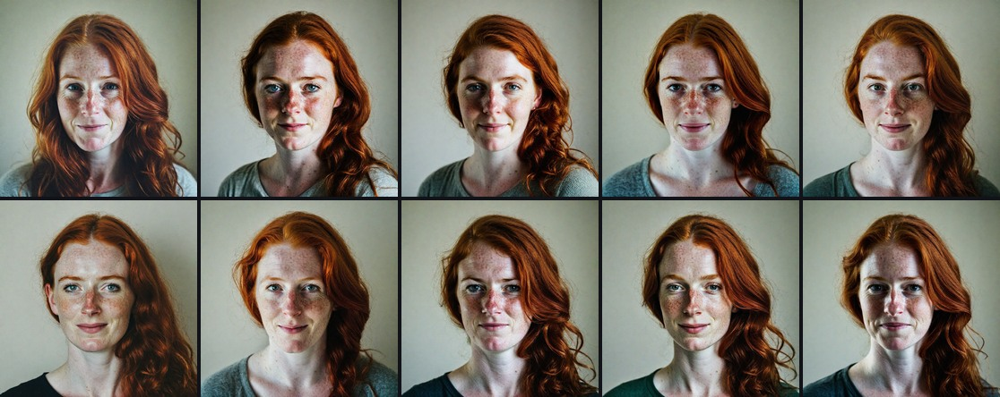

### 1d. The identity can be reused

Selecting a person stores the identity vector, not merely one photograph. Here, two identities are each rendered once from the front and once in profile. The pose changes while the person remains recognizable.

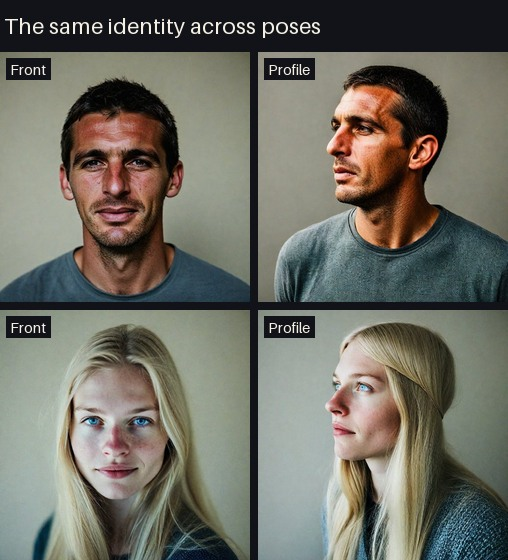


## 2. What I tried

**Overall result:** every prompt-only technique below creates some visible variation, but very little reliable identity variation on its own. Seeds, facial-feature words, biographies, lenses, age, clothing, and setting can change surface details or occasionally produce a genuinely new person; none consistently prevents the generator from returning to the same small family of faces. Prompt variation is therefore useful for enriching a large candidate pool, not for defining the final roster.

### 2.1. Same prompt, different seeds

The simplest approach is to lock a prompt and change only the random seed. This still produces many very similar faces. The comparison uses 12 contiguous seeds for each of three prompts, once with RealVisXL and once with Z-Image:

The positive clothing instructions and a negative prompt for bare chests avoid turning a face-diversity experiment into a clothing experiment.

The comparison below preserves all twelve contiguous seeds from each model. Every prompt is followed by two rows of RealVisXL images and two rows of Z-Image images.

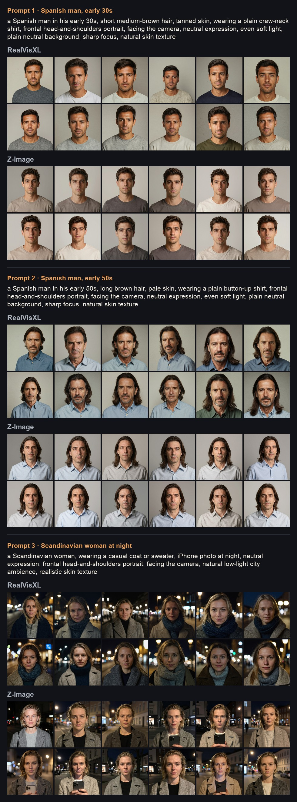

Each row below contains all 66 pairwise ArcFace comparisons among the 12 contiguous seeds:

| Model | Prompt | Mean cosine | Minimum | Maximum | Maximum difference | Most distant seeds |
|---|---|---:|---:|---:|---:|---|
| RealVisXL | Spanish man, 30s | `0.477` | `0.268` | `0.603` | **`0.732`** | `4101` / `4105` |
| Z-Image | Spanish man, 30s | `0.580` | `0.433` | `0.703` | **`0.567`** | `4103` / `4104` |
| RealVisXL | Spanish man, 50s | `0.540` | `0.404` | `0.661` | **`0.596`** | `4101` / `4108` |
| Z-Image | Spanish man, 50s | `0.589` | `0.434` | `0.716` | **`0.566`** | `4105` / `4107` |
| RealVisXL | Scandinavian woman, night | `0.356` | `0.203` | `0.561` | **`0.797`** | `4105` / `4110` |
| Z-Image | Scandinavian woman, night | `0.467` | `0.293` | `0.617` | **`0.707`** | `4100` / `4103` |

ArcFace cosine similarity is `1.0` for identical embedding directions; lower values indicate more distinct faces. In this overview, maximum cosine difference means:

$$
d_{\max}=1-\min_{i<j}\cos(x_i,x_j)
$$

ArcFace distance is useful for searching a large pool, but it is not the definition of a different person. Two faces can be far apart in embedding space because of pose, lighting, styling, or an artifact and still look like the same person to a human. Many of these faces look extremely similar to me despite having decent cosine distance. The pipeline therefore uses ArcFace to create shortlists and detect likely collisions, but subjective identity is decided by human review.

### 2.2. Specifying facial features

My next attempt was adding specific facial features to the prompt.

```text
gaunt and hollow-cheeked, weathered sun-damaged skin,
plain forgettable face

heavyset with a full round face, ruddy complexion, ordinary-looking

lean and wiry, narrow face, freckled olive skin, homely

stocky with a broad flat face and thick neck,
pale indoor complexion, plain

soft-featured with tired sunken eyes, sallow skin,
unremarkable face

barrel-chested with a wide jaw and deep-set eyes,
rugged weathered skin, plain
```

With one fixed seed, those prompts alter weight, skin, and face shape, but the results can still read as the same underlying person.

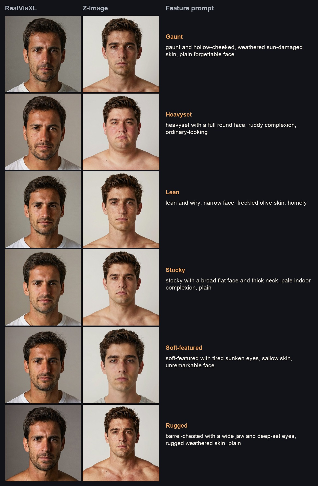

In a six-seed comparison, the normalized embeddings for each prompt were averaged into a prompt centroid. Across the 15 centroid pairs, mean cosine similarity was `0.857`. The most distant prompts were **heavyset** and **rugged**, with cosine similarity `0.794` and a maximum cosine difference of only **`0.206`**.

The matching Scandinavian-women comparison keeps this common prompt:

```text
a Scandinavian woman in her late 20s, long light-blonde hair,
fair skin, blue eyes, wearing a plain crew-neck sweater,
[one feature clause], frontal head-and-shoulders portrait,
facing the camera, neutral expression, even soft light,
plain neutral background, sharp focus, natural skin texture
```

It then compares three opposing pairs, using the same four seeds and both generators:

```text
a wide nose with a broad bridge and rounded tip
a thin narrow nose with a slim bridge and refined tip

large wide-set eyes
small close-set eyes

a broad wide chin and square jaw
a narrow pointed chin and tapered jaw
```

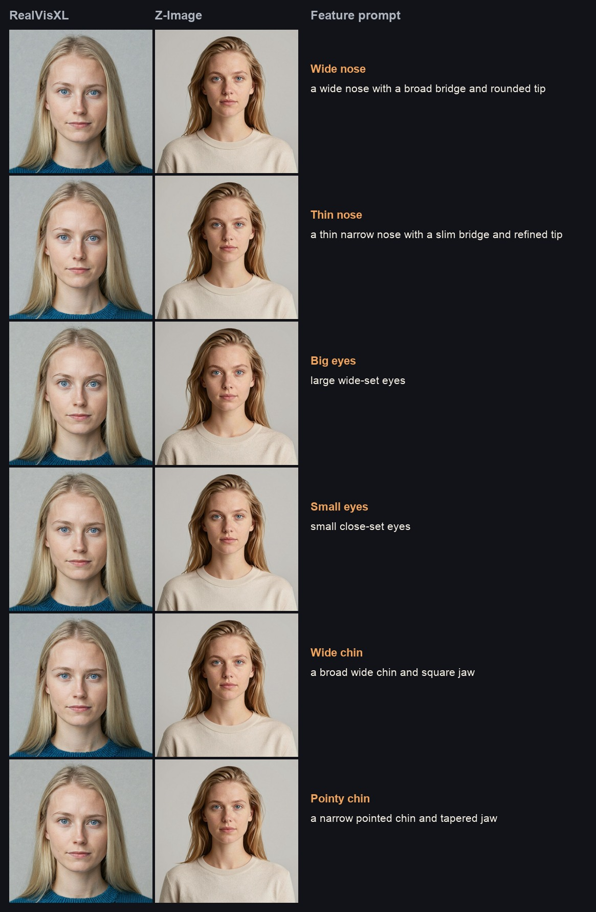

For each model, the four embeddings from one feature prompt were averaged into a normalized prompt centroid. The 15 pairwise centroid comparisons were:

| Model | Mean cosine | Minimum cosine | Maximum difference | Most distant feature prompts |
|---|---:|---:|---:|---|
| RealVisXL | `0.870` | `0.818` | **`0.182`** | big eyes / wide chin |
| Z-Image | `0.916` | `0.877` | **`0.123`** | big eyes / wide nose |

The two nose prompts were actually the most similar RealVisXL centroids (`0.926`), while small eyes and wide nose were the most similar Z-Image centroids (`0.964`). The verbal opposites changed visible details without reliably moving the generated identity very far.

#### Combining all three feature instructions

A stronger version combines the three related instructions into two opposing bundles:

```text
wide nose with a broad bridge and rounded tip,
large wide-set eyes, broad wide chin and square jaw

small narrow nose with a slim bridge and refined tip,
small close-set eyes, narrow pointed chin and tapered jaw
```

For both a Spanish man and a Spanish woman, the common portrait prompt and seed stay fixed while only the feature bundle changes. Each row places the RealVisXL and Z-Image results from the same prompt together—eight images in total.

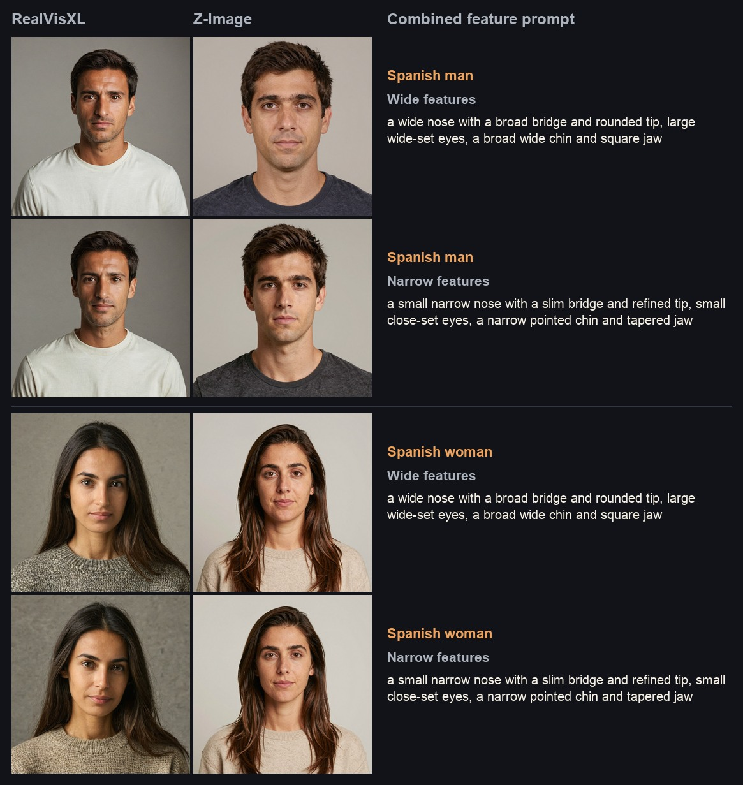

RealVisXL changes the bundled features only subtly. Z-Image responds more visibly, especially for the man, but each fixed-seed pair still retains a strongly recurring underlying face.

**Result:** feature words enrich a candidate pool, but even large verbal contrasts do not guarantee different identities.

### 2.3. Giving each character two background details

Another way to push the generator away from its default face is to give each nominal person a small amount of biography. The details are deliberately not facial instructions: the model has to draw on the associations it learned for a life or occupation rather than being told to change a nose or jaw.

The source library is much larger than the prompt for any one person. It includes details such as:

- works as a management consultant
- plays piano in his free time
- goes rock climbing on weekends
- collects and repairs old radios
- is afraid of heights
- etc.

Each candidate receives exactly two compatible details. For example:

```text
Background:
- works as a management consultant
- plays piano in his free time
```

The implemented Spanish and Scandinavian libraries each contain 16 occupations and 16 personal details. Drawing one from each gives 256 compatible combinations without making any individual prompt long. The controlled experiment rendered 16 disjoint pairs with the same three seeds in both generators; six representative pairs are shown below.

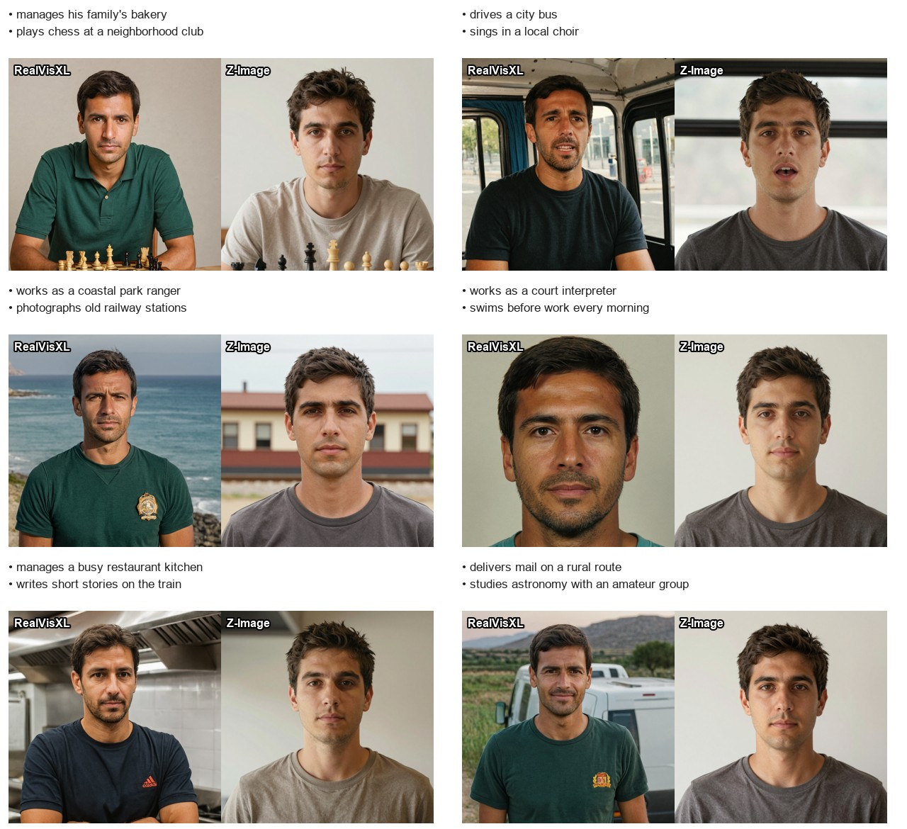

For every pair, the three rendered-face embeddings were averaged into a normalized prompt centroid. The 120 pairwise centroid comparisons per model were:

| Model | Mean cosine | Minimum cosine | Maximum difference |
|---|---:|---:|---:|
| RealVisXL | `0.554` | `0.341` | **`0.659`** |
| Z-Image | `0.802` | `0.623` | **`0.377`** |

The visual result is more informative than the metric alone. RealVisXL often changed the face noticeably, but it also ignored the requested neutral background and introduced occupational scenery, clothing, pose, or expression. Z-Image kept the presentation more consistent, but returned a strongly recurring face across many of the biographies. The details enrich the candidate pool; they do not directly control identity.

#### Why stop at two details?

Long prompts are not simply compressed into one short representation. RealVisXL uses SDXL's two CLIP tokenizers, whose native text window is 77 tokens; ComfyUI can condition additional chunks when a prompt is longer. Z-Image uses a different, longer-context text encoder. Even when text is accepted, however, adding more clauses makes them compete for attention and does not guarantee that the later details influence the image.

All 16 two-detail RealVisXL prompts above were 72–75 tokens, including special tokens, so each fitted in one native SDXL window. A cumulative length check using the same four seeds produced:

| Details | SDXL tokens | RealVisXL distance from no details | Z-Image distance from no details |
|---:|---:|---:|---:|
| 0 | `59` | — | — |
| 1 | `67` | `0.105` | `0.059` |
| 2 | `74` | **`0.255`** | **`0.165`** |
| 4 | `86` | `0.386` | `0.140` |
| 8 | `111` | `0.313` | `0.139` |

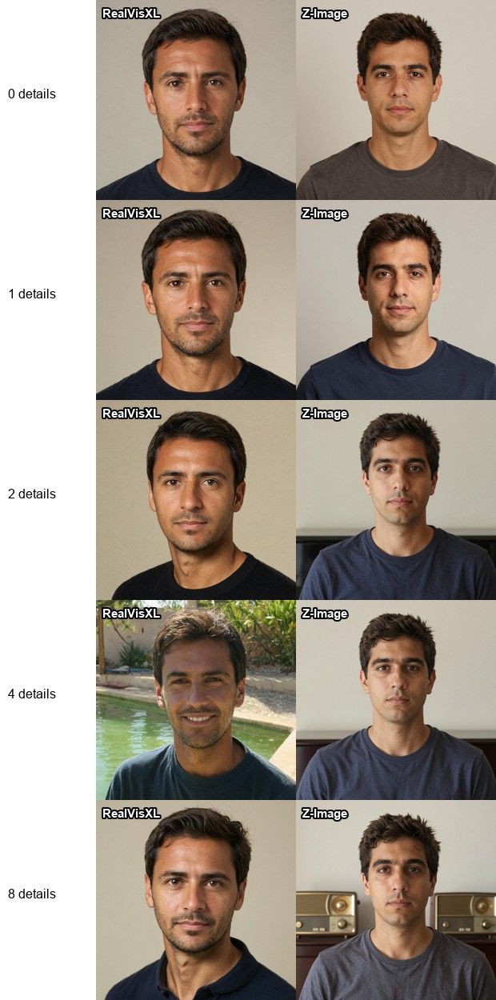

The effect was not monotonic. Four details moved the RealVisXL centroid farther than eight, while Z-Image reached its largest shift at two and then plateaued. Two concise details are therefore the production default: they create useful variation, remain easy to audit, and avoid relying on a second SDXL text chunk.

**Result:** short character backgrounds are useful for over-generating a richer seed cloud, especially with RealVisXL, but the final distinction between people still has to come from the embedding shortlist, identity-cloud sampling, and human review.

### 2.4. Changing the lens and framing

Camera language changes perspective and composition as well as the face. The comparison holds the person prompt fixed and tests a close 26 mm-equivalent phone portrait, a 35 mm environmental portrait, and an 85 mm studio headshot. Each uses four shared seeds in both final generators.

```text
close iPhone portrait, 26 mm equivalent wide lens,
slight perspective distortion, face filling most of the frame,
casual available light

35 mm environmental portrait, upper torso visible,
camera at eye level, subject separated from a softly detailed
everyday background

85 mm portrait lens, tight head-and-shoulders framing,
compressed perspective, even soft studio light,
plain neutral background
```

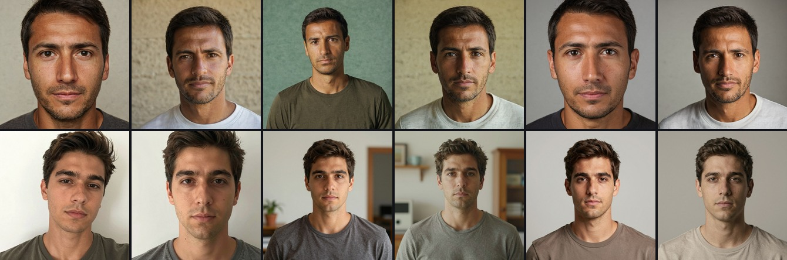

After averaging the four shared-seed embeddings for each camera prompt, the three centroid pairs had:

| Model | Mean cosine | Minimum cosine | Maximum difference | Most distant camera prompts |
|---|---:|---:|---:|---|
| RealVisXL | `0.721` | `0.663` | **`0.337`** | 35 mm environmental / phone close-up |
| Z-Image | `0.802` | `0.798` | **`0.202`** | 35 mm environmental / phone close-up |

For RealVisXL, camera language moved the prompt centroids almost twice as far as the opposing Scandinavian feature words (`0.337` versus `0.182`). Some of that extra separation comes from perspective and context rather than a clean change of identity.

**Result:** lenses, framing, CFG, age, and occupation can decorrelate outputs, but often by changing attributes that were meant to stay common.

### 2.5. Arc2Face: the right geometry with an image-quality bottleneck

Arc2Face was the first indication that the problem should be solved in identity space rather than through increasingly elaborate prose. The keeper embeddings defined a demographic cloud; new vectors were sampled from its outer region and rejected when they were too close to a keeper or an already accepted sample. Arc2Face then projected each normalized identity vector into the conditioning space of a Stable Diffusion 1.5 decoder:

```text
sample ArcFace subspace → Arc2Face → reference image → InstantID + RealVisXL
```

This separated identities much more directly than prompt variations, and several renders of one sampled vector remained recognizably the same person. The weakness was not the cloud sampling. It was the decoding route. Arc2Face produced a 512 px SD1.5 face with softer detail and a narrower visual style than the native 1024 px RealVisXL images.

Using that face as an intermediate donor created a lossy chain: the vector was decoded into pixels, detected and embedded again, and then decoded a second time by InstantID and RealVisXL. Every conversion could move the identity. An image-to-image polish pass improved texture but also demonstrated the problem by making the result look less like the sampled person.

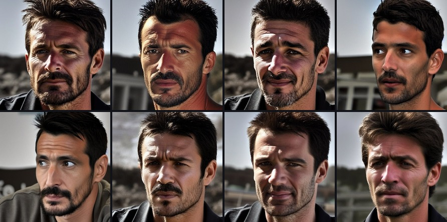

The final pipeline keeps the successful part and removes the bottleneck:

| | Arc2Face route | Final route |
|---|---|---|
| Sampled object | Normalized identity vector | Normalized `glintr100` identity vector, restored to its expected raw scale |
| First decode | Arc2Face with an SD1.5 backbone at 512 px | InstantID with RealVisXL at 1024 px |
| Intermediate face | Required as a donor or polishing input | None |
| Identity transformations | Vector → image → detected embedding → final image | Vector → final image |
| Cohort and pose controls | Mostly inherited from the reference face | Demographic prompt and explicit keypoint template |

**Result:** the identity-space sampling idea worked, but Arc2Face did not meet the visual-quality bar. Direct decoding preserves the same geometric strategy while avoiding an unnecessary low-resolution image conversion.

### 2.6. Direct identity-vector decoding

The decisive experiment was to feed a sampled `glintr100` identity vector directly to InstantID. It rendered coherent, demographically consistent faces at native RealVisXL resolution, without the lower-quality intermediate reference image.

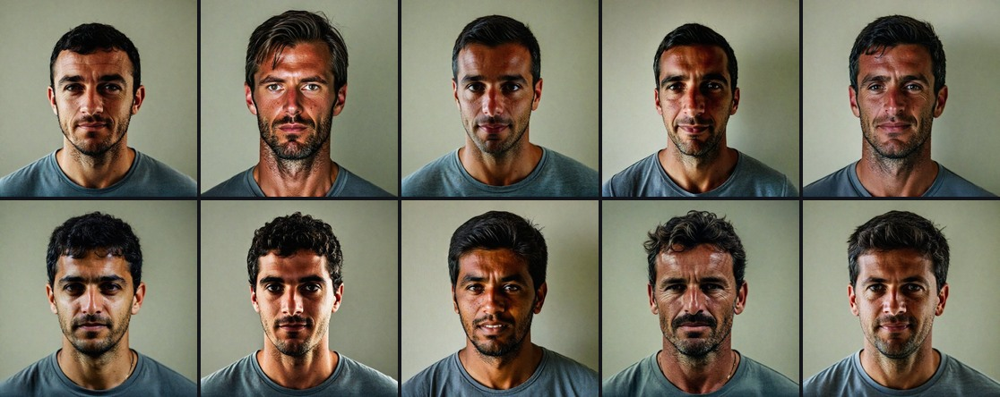

**Result:** retain the geometry of the Arc2Face approach, but decode the vector directly with InstantID and RealVisXL.

## 3. Final pipeline

### 3.1. Generate a broad seed pool

RealVisXL and Z-Image each generate about 500 candidates under the same demographic lock. The production locks match the cohorts used in the controlled comparisons: Spanish men in their early 30s with short medium-brown hair and tanned skin, or Scandinavian women in their late 20s with long light-blonde hair, fair skin, and blue eyes.

The default run creates 100 prompt combinations and renders each with five different, collision-free seeds. Every combination contains:

- one concise facial-feature bundle, such as `wide nose, large wide-set eyes, broad square chin`;
- one lens and framing choice: a 26 mm phone close-up, 35 mm environmental portrait, 50 mm head-and-shoulders portrait, or 85 mm tight headshot; and
- two short character-background details, one occupation and one personal detail.

The facial and camera clauses are deliberately short and appear before the background details so the prompt does not bury them at the end. They are candidate-pool seasoning, not identity labels: a lens can move ArcFace through crop or perspective, and a requested feature can leave the generator's recurring underlying face intact. Multiple seeds and both image models add further variation. The shared demographic lock preserves the cohort, while automatic filtering and human review remove off-cohort faces, poor renders, and subjective duplicates.

### 3.2. Build an ArcFace-diverse shortlist

Each model's 500-image pool is reduced to an 80-face shortlist. Normalize every ArcFace embedding, start with the candidate farthest from the normalized centroid, then repeatedly choose the candidate whose nearest selected neighbor is least similar:

$$
i_{t+1}=\arg\min_{i\notin S_t}\;\max_{j\in S_t}x_i^\top x_j
$$

This is greedy farthest-point selection in cosine space. It prevents the dense, generic center of the generated pool from dominating the shortlist, but it is only a search heuristic. It can reward an unusual crop, expression, lighting condition, or rendering defect rather than a genuinely new identity.

### 3.3. Choose the seed bank by eye

A human reviews the 80 RealVisXL and 80 Z-Image candidates together and chooses roughly 40 from each model. The selected faces must look like different people, still satisfy the shared high-level description, and be good enough to serve as identity anchors. A numerical distance cannot overrule an obvious subjective duplicate; if a model produces fewer than 40 convincing identities, the quota should not force weak faces into the bank.

This leaves an approximately 80-person seed bank: broad enough to describe how the cohort varies, but small enough for every identity to have been inspected.

### 3.4. Fit the common identity cloud

For normalized keeper embeddings $x_i$, compute the center and principal directions:

$$
\mu=\frac{1}{n}\sum_{i=1}^{n}x_i,
\qquad
X=\begin{bmatrix}
x_1-\mu\\
\vdots\\
x_n-\mu
\end{bmatrix}=U\Sigma V^\top,
\qquad
\lambda_j=\frac{\Sigma_j^2}{n-1}
$$

The center represents the cohort's common identity direction. The principal components describe the directions in which this particular cohort varies. Fitting the cloud after automatic shortlisting and human seed selection prevents both repeated generic faces and metric-driven false outliers from dominating these quantities.

### 3.5. Sample for difference without leaving the cohort

Draw a covariance-shaped deviation, then place it at a radius $r$ sampled uniformly between the keeper cloud's empirical p60 and p99 radii:

$$
z_j\sim\mathcal N(0,\lambda_j),
\qquad
d=zV^\top,
\qquad
\widetilde d=r\frac{d}{\lVert d\rVert},
\qquad
y=\frac{\mu+\widetilde d}{\lVert\mu+\widetilde d\rVert}
$$

The covariance says “vary in ways actually observed among this cohort.” Sampling uniformly inside that empirical percentile band says “do not collapse back to its average face.” It does not sample radii according to their empirical frequency. The outer-shell effect depends on the cloud's effective rank, so it is treated as a proposal strategy rather than proof that every sample will be diverse.

A cosine gate rejects any proposal too similar to a keeper or an already accepted sibling:

$$
\max_{q\in K\cup A}y^\top q\le\tau,
\qquad
\tau=\max\left(
\mathrm{p95}\{x_i^\top x_j:i<j\},
0.45
\right)
$$

With very small keeper banks, PCA samples occupy a narrow span and acceptance can approach zero. The approximately 80 human-reviewed seeds make the fitted cloud substantially richer. Sampling remains a proposal stage: its acceptance rate and rejected-candidate count must be recorded, and every accepted vector still has to survive image-space review.

### 3.6. Decode, filter, and make the final human selection

The original seed identities and the accepted cloud samples are decoded with the same InstantID and RealVisXL settings. The resulting photographs are re-embedded with a separate ArcFace model, because the final object being judged is the rendered face—not merely the target vector. Detection failures, identities that do not survive multiple images, and likely collisions are removed or ranked down automatically.

The remaining candidates are reviewed together one more time. The final human selection keeps the faces that look most clearly like different people while retaining the cohort's shared traits and adequate image quality. In the recorded 160-candidate tournaments, sampled identities contributed 30 of 50 Spanish-men finalists and 26 of 50 Scandinavian-women finalists, so sampling adds valuable candidates without replacing the strong observed seeds. The underlying counts and scores are retained in the [Spanish-men](data/es_m_prod_report.json) and [Scandinavian-women](data/sc_f_prod_report.json) reports.

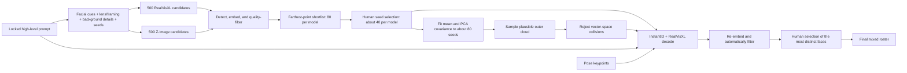

The sampled cloud expands the cohort rather than replacing good observations from the original generators: both sampled identities and strong RealVisXL or Z-Image seed faces remain eligible for the final set. ArcFace makes both review stages manageable; it does not make the subjective decision for them.

The implementation is split into generation, embedding, farthest-point shortlisting, manifest-based human seed curation, cloud sampling, InstantID rendering, decoded-image ranking, and final human review. The geometry is in [`src/different_pipeline_generator`](src/different_pipeline_generator), the experiment sequence is in [`docs/experiments.md`](docs/experiments.md), and the model-space details are in [`docs/pipeline.md`](docs/pipeline.md).

All included faces are synthetic. Demographic prompts are generation constraints, not classifiers or claims about real people. Face embeddings can carry model bias, so decoded-image checks and visual review remain part of the pipeline.

## 4. More demographics

The same general approach can build other superficially coherent groups. These rows contain five different generated people selected from four additional demographic libraries. As noted above, they come from related pipeline runs and are examples of the broader result rather than exact replays of every setting in Section 3.

### 4a. Nigerian men

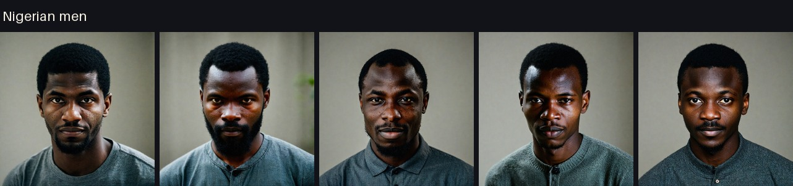

### 4b. German women

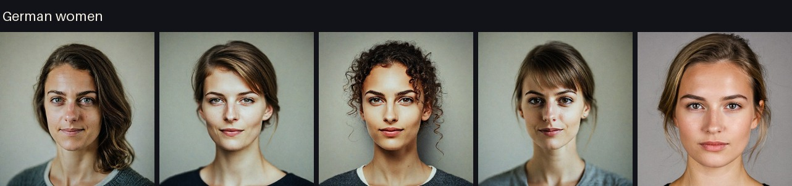

### 4c. Japanese women

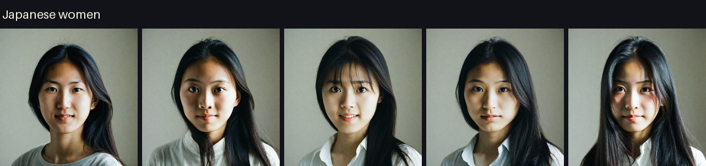

### 4d. Romanian men

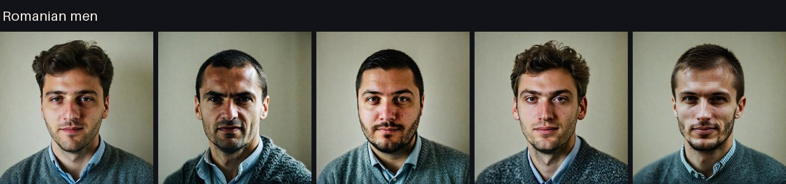

### 4e. The same faces from another angle

One identity from each row is shown again in profile. From top to bottom, the pairs are Nigerian, German, Japanese, and Romanian. The demographic appearance remains shared within each group, while the stored identity survives the pose change.

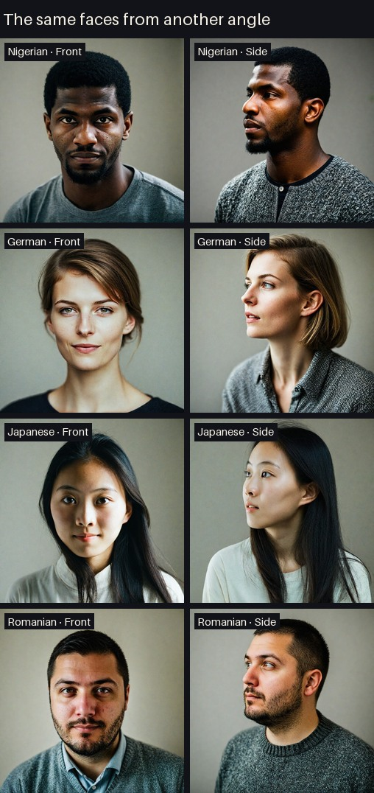

## Development

The lightweight test environment does not install model weights or GPU libraries:

```bash
python -m venv .venv
source .venv/bin/activate
python -m pip install -e '.[dev]'
pytest
```

Install the `embedding`, `gpu`, or `tokenization` extras only for the stages that need them. The infrastructure and model assumptions are listed in [`docs/pipeline.md`](docs/pipeline.md).

AI agents assisted with implementation, experiment automation, code review, and documentation throughout this project.
